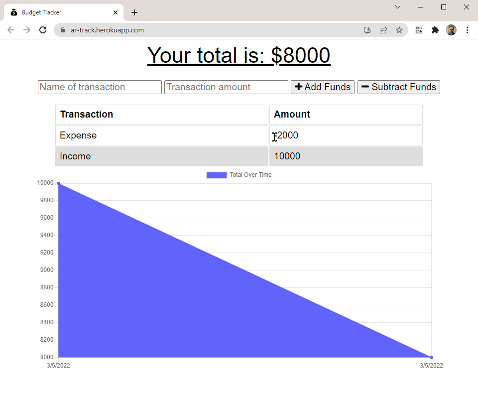

# ar-budget-racker

## Description
This application allows the user to track their withdrawals and deposits on a computer or mobile device with or without an internet connection. If they add a transaction while offline, it automatically gets added once an internet connection is re-established and then the user is notified about the addition. The application can also be installed locally as a PWA (progressive web application).

## Screenshot

## Application Link

https://ar-track.herokuapp.com/

## Questions

Please send your questions and / or comments to **Arslan Razi** at arslan.razi@outlook.com, or contact me on [GitHub](https://github.com/arslan-razi).

## License

This project is licensed under the terms of the [MIT](https://opensource.org/licenses/MIT) license.
